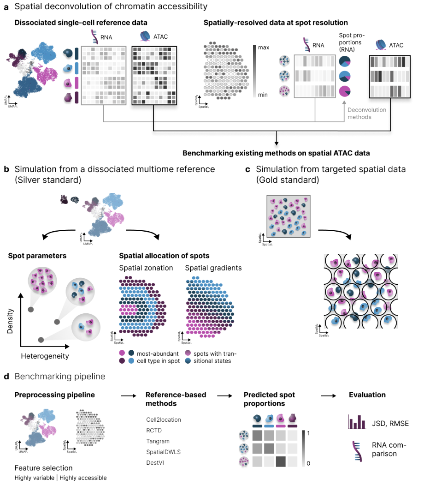

deconvATAC
====================

The deconvATAC package provides a framework for simulating spatial multi-modal data from dissociated single-cell data, as well as python wrapper functions for top-performing deconvolution tools. 
The package further provides metrics for evaluating the performance of deconvolution. 

.. toctree::
   :includehidden:
   :maxdepth: 3

   installation
   notebooks/index

